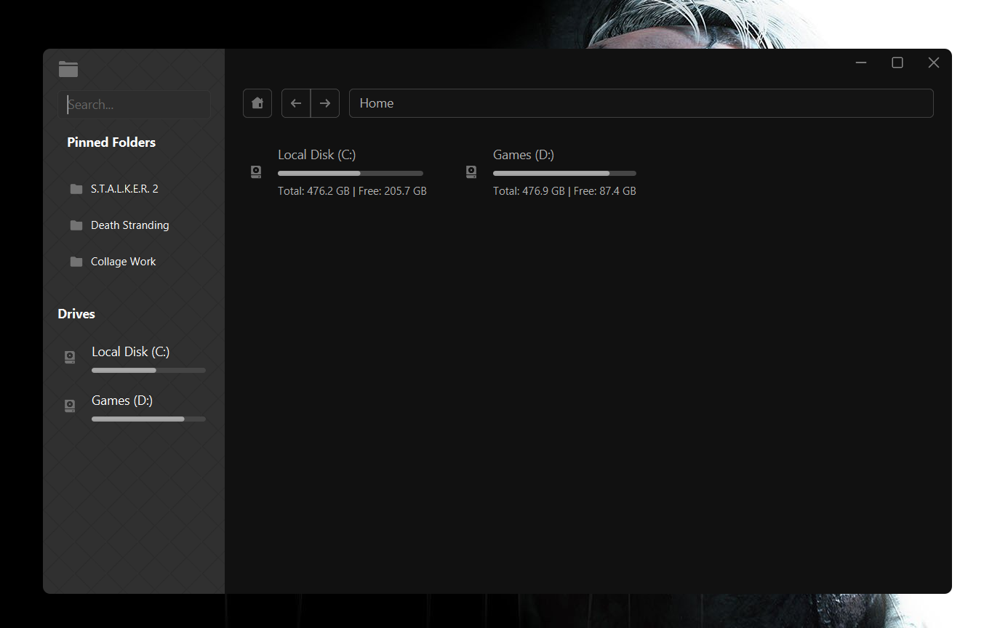
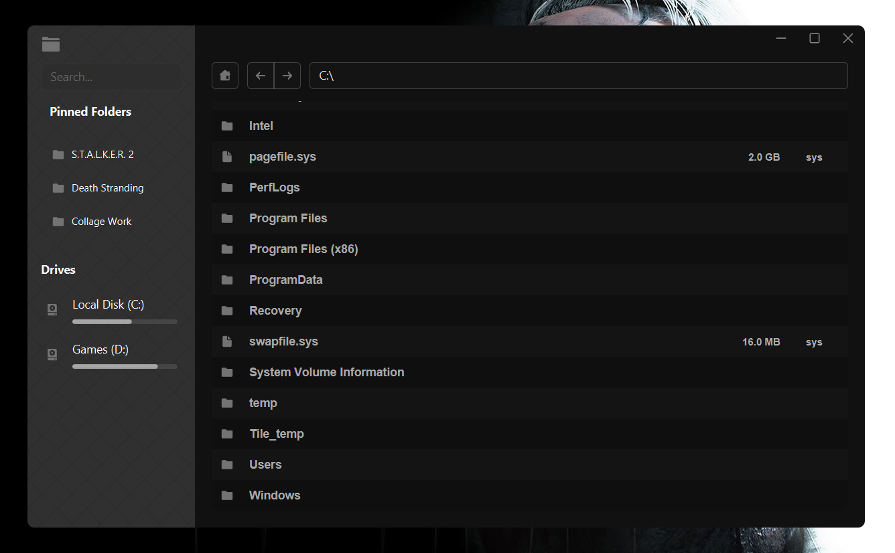

A javafx based file exploror with a modren drak design

## To-Do List

-  [x] Implement main functions

   -  [x] Open
   -  [ ] Open in terminal
   -  [x] Copy
   -  [x] Cut
   -  [x] Delete
   -  [x] Rename

-  [x] Create a custom context menu (ensure functionality!)

-  [ ] Refactor code for cleaner structure

-  [ ] Fix file names (e.g., .gitignore)

-  [ ] Add audio file preview

-  [ ] Add video file preview

-  [ ] Add image file preview

-  [ ] Add markdown file preview

-  [x] Manage favorite folders on the sidebar and make them functional

-  [ ] Ensure the context bar is always visible (if there's not enough space)
